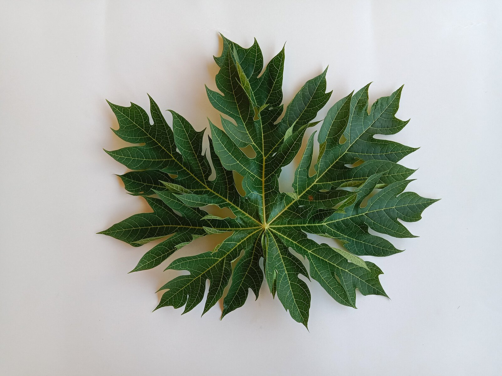

# Dataset
Dataset untuk menyimpan file berupa objek  foto daun pepaya dan lidah buaya untuk proses identifikasi pada program 

# Collecting Data-Herb Leaf Dataset
Terdapat 2 objek gambar yang nanti akan dijadikan sebagai data utama untuk memecahkan kasus pada program pengenalan gambar.
Object ini terdiri dari ;
-Daun pepaya
-Lidah buaya
Masing-masing gambar berjumlah 50 gambar.

# Gambar tersebut mempunyai beberapa ketentuan yaitu,
-background putih
-format jpg
-dimensi 1600*1200 pixel
-rotasi gambar (horizontal,vertikal,dan diagonal)
